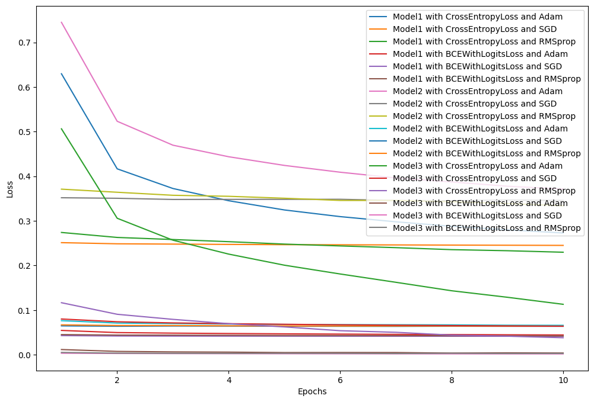

# **CNN, Fation MNIST 모델 구조 및 성능 평가**

---

#### 융합전자공학과

#### 학번: 219123207

#### 학년: 3학년

#### 이름: 박세직

#### 수업: 인공지능과 머신러닝

---

**1. 서론**
본 보고서는 딥 러닝 모델의 구조와 성능을 분석하고, 다양한 손실 함수 및 옵티마이저를 사용하여 모델의 학습 과정을 평가함. 모델 1, 2, 3은 각기 다른 레이어 구성과 특징을 가지며, 이들의 성능은 CrossEntropyLoss와 BCEWithLogitsLoss 손실 함수, 그리고 Adam, SGD, RMSprop 옵티마이저를 사용하여 평가됨.

**2. 모델 구조**

### 모델1 : 2개 레이어 CNN

-   **Model1**: 이 모델은 두 개의 합성곱 레이어를 가지며 드롭아웃을 포함하지 않습니다. 첫 번째 레이어는 1개의 입력 채널을 받아 10개의 출력 채널을 생성하고, 두 번째 레이어는 10개의 입력 채널을 받아 20개의 출력 채널을 생성합니다. 각 합성곱 레이어 후에는 최대 풀링과 ReLU 활성화 함수가 적용되고, 완전 연결 레이어를 통해 최종 출력이 생성됩니다.
    

### 모델2 : 2개 레이어 + DropOut

-   **Model2**: Model1과 유사하지만, 두 번째 합성곱 레이어와 최대 풀링 사이에 **드롭아웃** 레이어가 추가되어 있습니다. 이 드롭아웃 레이어는 과적합을 방지하고 일반화 성능을 향상시키는 데 도움을 줍니다.  
     (모델의 이미지는 모델 1과 같음)

### 모델3 : 3개 레이어

-   **Model3**: 세 개의 합성곱 레이어를 가지며, 각 레이어는 점차적으로 출력 채널의 수를 증가시킵니다. 이 모델은 패딩을 사용하여 입력의 공간적 크기를 유지합니다. 최대 풀링과 ReLU 활성화 함수가 적용된 후, 두 개의 완전 연결 레이어를 통해 최종 출력을 생성합니다.
    

**3. 손실 함수 및 옵티마이저 설명**

-   **손실 함수**:

    -   **CrossEntropyLoss**: 다중 클래스 분류 문제에 적합합니다. 각 클래스의 확률을 예측하여 실제 레이블과의 차이를 최소화하는 방식으로 작동합니다.
    -   **BCEWithLogitsLoss**: 이진 분류 또는 멀티 라벨 분류에 적합합니다. 로지스틱 회귀를 사용하여 각 클래스의 확률을 예측하고, 이를 실제 값과 비교합니다.

-   **옵티마이저**:
    -   **Adam**: 빠른 수렴 속도를 제공합니다. 모멘텀과 RMSprop의 장점을 결합하여 효율적인 학습이 가능합니다.
    -   **SGD (Stochastic Gradient Descent)**: 보다 전통적이고 안정적인 성능을 제공합니다. 간단한 구조로 인해 다양한 문제에 적용 가능합니다.
    -   **RMSprop**: 비등방성 데이터셋에서 효과적으로 작동합니다. 학습률을 조정하여 불규칙한 데이터셋에서도 안정적인 학습을 지원합니다.

**4. 실험 결과**

각 모델과 옵티마이저의 조합에 따른 성능은 Loss 값으로 평가되었습니다.
| 모델 | 손실 함수 | 옵티마이저 | epoch 10 손실 값 |
| ------ | ----------------- | ---------- | ---------------- |
| Model1 | CrossEntropyLoss | Adam | 0.2729 |
| Model1 | CrossEntropyLoss | SGD | 0.2451 |
| Model1 | CrossEntropyLoss | RMSprop | 0.2298 |
| Model1 | BCEWithLogitsLoss | Adam | 0.0444 |
| Model1 | BCEWithLogitsLoss | SGD | 0.0415 |
| Model1 | BCEWithLogitsLoss | RMSprop | 0.0422 |
| Model2 | CrossEntropyLoss | Adam | 0.3713 |
| Model2 | CrossEntropyLoss | SGD | 0.3457 |
| Model2 | CrossEntropyLoss | RMSprop | 0.3339 |
| Model2 | BCEWithLogitsLoss | Adam | 0.0660 |
| Model2 | BCEWithLogitsLoss | SGD | 0.0638 |
| Model2 | BCEWithLogitsLoss | RMSprop | 0.0641 |
| Model3 | CrossEntropyLoss | Adam | 0.1131 |
| Model3 | CrossEntropyLoss | SGD | 0.0641 |
| Model3 | CrossEntropyLoss | RMSprop | 0.0383 |
| Model3 | BCEWithLogitsLoss | Adam | 0.0040 |
| Model3 | BCEWithLogitsLoss | SGD | 0.0021 |
| Model3 | BCEWithLogitsLoss | RMSprop | 0.0031 |

## **LOSS 변화 그래프**

**5. 실험 성능 평가**

모델 1과 모델 2 사이, 그리고 모델 1, 2와 모델 3 사이의 차이점에 대한 분석을 갱신하면서, 사용된 손실 함수와 옵티마이저 별로 어떻게 loss 값이 달라지는지도 함께 살펴보겠습니다.

### 모델 1과 모델 2의 차이점

-   **아키텍처**: 모델 1과 모델 2는 기본적인 구조는 유사하지만 모델 2에 드롭아웃이 추가되어 있습니다. 이는 오버피팅을 방지할 목적으로 사용됩니다.
-   **성능**: 모델 1이 모델 2보다 일관적으로 낮은 loss 값을 보이는데, 이는 드롭아웃 레이어가 초기 학습에 영향을 미치기 때문일 수 있습니다. 드롭아웃 비율이 너무 높으면 실제로 학습 효율성이 저하되어 높은 loss 값을 초래할 수 있습니다. 아마도 dropoout이 기본값인 50%가 비율이 너무 높아 학습에 방해가 됬을수도 있습니다.

### 모델 1, 2와 모델 3의 차이점

-   **아키텍처**: 모델 3은 추가된 세 번째 합성곱 레이어를 포함하여 더 깊은 구조를 가지고 있습니다.
-   **성능**: 모델 3은 특히 낮은 loss 값을 보여주며, 이는 더 깊은 네트워크가 데이터의 복잡한 특성을 더 잘 학습할 수 있음을 의미합니다.

### 손실 함수와 옵티마이저 별 loss 값 분석

-   **CrossEntropyLoss**: 이 손실 함수는 일반적으로 분류 문제에 사용되며, 모델 1, 2와 모델 3 모두에서 Adam 옵티마이저와 결합했을 때 상대적으로 높은 loss 값을 나타냅니다. SGD와 RMSprop는 이 손실 함수에 대해 보다 낮은 loss 값을 달성하는 것으로 보입니다.
-   **BCEWithLogitsLoss**: 이 손실 함수는 모델 1과 2에서는 비슷한 경향을 보이지만, 모델 3에서는 특히 낮은 loss 값을 달성합니다. 이는 BCEWithLogitsLoss가 모델 3의 더 깊은 구조에 더 적합할 수 있음을 시사합니다.
-   **옵티마이저**: Adam은 빠른 수렴을 제공하지만, 특히 모델 3에서 SGD와 RMSprop이 더 낮은 loss 값을 보여주었습니다. 이는 옵티마이저의 선택이 모델의 구조와 매우 밀접한 관계가 있음을 나타냅니다.

Model3 with BCEWithLogitsLoss and SGD 조합이 가장 낮은 손실 값을 보여 가장 효과적인 조합으로 평가되었습니다. 이러한 결과는 Model3의 더 복잡한 구조와 BCEWithLogitsLoss의 효과, 그리고 SGD 옵티마이저의 안정적인 성능이 상호 작용한 결과로 해석될 수 있습니다.

**6. 결론 및 응용**
최종적으로 선택된 Model3 with BCEWithLogitsLoss and SGD 조합은 10 에포크 동안 훈련 데이터로 학습된 후, 테스트 데이터셋에서 정확도 평가를 진행하였습니다. 평가 결과, 이 모델은 테스트 손실(Test Loss) 0.0009와 90.07%의 테스트 정확도(Test Accuracy)를 달성했습니다. 이러한 높은 정확도는 Model3의 복잡한 구조와 BCEWithLogitsLoss의 효율적인 이진 분류 능력, 그리고 SGD의 안정적인 최적화 능력이 결합된 결과로 볼 수 있습니다.
